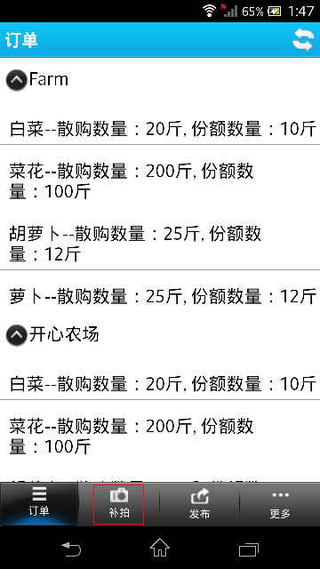
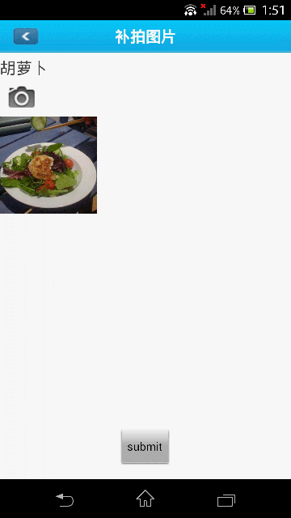

##产品图片增补  
 在生产者页面点击[农场清单](http://food.xinrenlian.com/300.aspx)链接，如下图所示：  
   
 此时会出现农场列表，找到需要增补产品图片的农场点击[产品列表](http://food.xinrenlian.com/310.aspx),如下图所示：  
   
 在产品列表页面，选择需要增补图片的产品，点击编辑，如下图  
   
 进入产品编辑页面
 - 上传新的主形象照片，此时当前主形象照片会转为相册中的普通照片  
 - 在当前商品相册，上传新的相册图片  

  

##手机客户端更新产品图片  

登录手机客户端后，点击补拍按钮  
  

进入产品补拍列表页  
  

选择需要补拍图片的产品，进入产品图片拍照页面   
  

然后点击拍照按钮，可以选择拍照或者从相册选择图片  
  

完成拍照或图片选择，进入图片裁剪页  
  

完成图片裁剪后，返回到图片拍照页面  
  

此时点击提交按钮即可完成产品图片的更新。