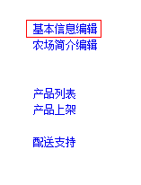
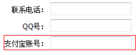

 ##农场信息修改  
 1.在生产者页面点击[农场清单](http://food.xinrenlian.com/300.aspx)链接，如下图所示：  
   
 2.此时会出现农场列表，找到需要修改信息的农场点击[基本信息编辑](http://food.xinrenlian.com/300.aspx),如下图所示：  
   
 - 支付宝信息修改：找到支付宝输入项进行编辑，如下图所示：  
    
 - 更新形象图片：在对应的形象图片这一行，点击浏览按钮，然后选择合适的图片即可，如下图：
   
