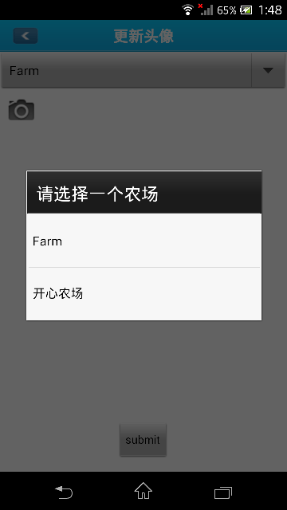
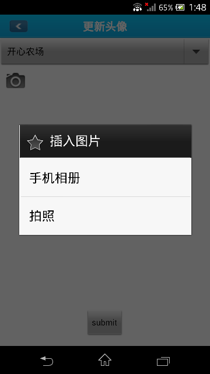

##农场信息修改    
 1.在生产者页面点击[农场清单](http://food.xinrenlian.com/300.aspx)链接，如下图所示：  
    
 2.此时会出现农场列表，找到需要修改信息的农场点击[基本信息编辑](http://food.xinrenlian.com/300.aspx),如下图所示：   
    
 - 支付宝信息修改：找到支付宝输入项进行编辑，如下图所示：  
    
 - 更新形象图片：在对应的形象图片这一行，点击浏览按钮，然后选择合适的图片即可，如下图：
    

##手机客户端更新农场形象图片 
登录手机客户端后，点击更多按钮
  

然后点击头像  
  

此时进入农场形象图片拍照页面，点击农场下拉列表选择希望更新图片的农场  
  

然后点击拍照按钮，可以选择拍照或者从相册选择图片  
  

完成拍照或图片选择，进入图片裁剪页  
  

完成图片裁剪后，返回到图片拍照页面  
  

此时点击提交按钮即可完成形象图片的更新。
